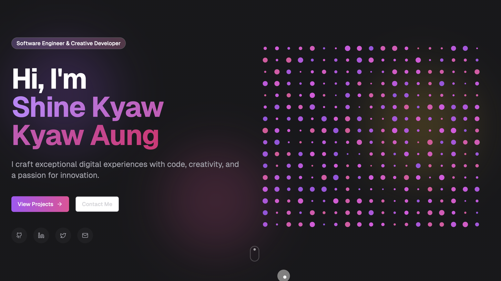

# Creative Portfolio

A modern and responsive creative portfolio built using [v0.dev](https://v0.dev) by Vercel.

## Live Demo

Check out the live demo: [https://v0-creative-portfolio-o7.vercel.app/](https://v0-creative-portfolio-o7.vercel.app/)

## Features

- Responsive design that works on all devices
- Modern UI with smooth animations
- Project showcase section
- About me section
- Contact information
- Built with cutting-edge web technologies

## Technologies Used

- [Next.js](https://nextjs.org/) - The React framework for production
- [Tailwind CSS](https://tailwindcss.com/) - Utility-first CSS framework
- [v0.dev](https://v0.dev) - AI-powered UI component generator
- [Vercel](https://vercel.com) - Deployment platform

## Getting Started

To run this project locally, follow these steps:

1. Clone the repository:
   \`\`\`bash
   git clone https://github.com/shinekyaw/Creative-Portfolio.git
   \`\`\`

2. Navigate to the project directory:
   \`\`\`bash
   cd Creative-Portfolio
   \`\`\`

3. Install dependencies:
   \`\`\`bash
   npm install
   \`\`\`

4. Run the development server:
   \`\`\`bash
   npm run dev
   \`\`\`

5. Open [http://localhost:3000](http://localhost:3000) in your browser to view the portfolio.

## Customization

To customize this portfolio for your own use:

1. Update the content in the appropriate components
2. Replace placeholder images with your own in the `public` folder
3. Modify the color scheme in `tailwind.config.js`
4. Update the metadata in `app/layout.tsx`

## Deployment

This project is configured for easy deployment on Vercel. To deploy your own version:

1. Fork this repository
2. Create a new project on Vercel
3. Connect your GitHub account and select this repository
4. Click "Deploy"

Vercel will automatically deploy your portfolio and provide you with a live URL.

## Contributing

Contributions are welcome! If you have suggestions for improvements, please open an issue or submit a pull request.

## License

This project is open source and available under the [MIT License](./LICENSE).
