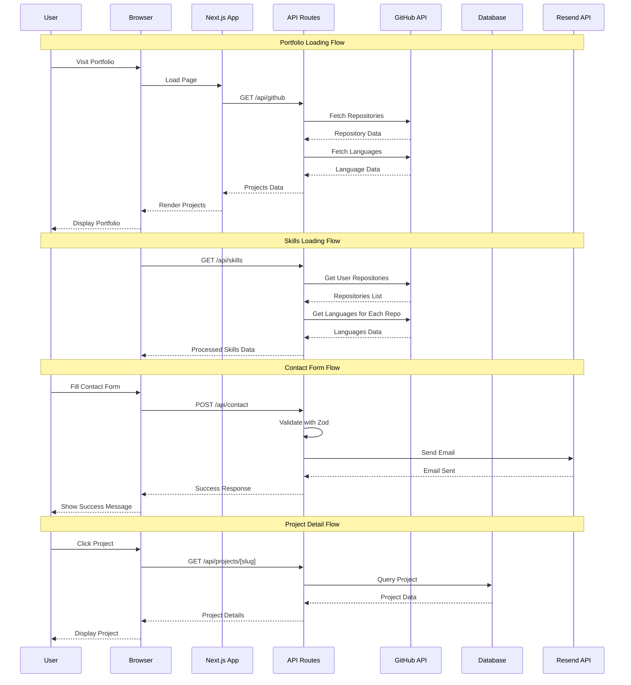

# Modern Portfolio - Xiro The Dev

<p align="center">
  <a href="https://nextjs.org/">
    
  </a>
  <a href="https://react.dev/">
    
  </a>
  <a href="https://www.typescriptlang.org/">
    
  </a>
  <a href="https://tailwindcss.com/">
    
  </a>
  <a href="https://storybook.js.org/">
    
  </a>
  <a href="https://prettier.io/">
    
  </a>
  <a href="https://github.com/xirothedev/modern-portfolio/blob/main/LICENSE.md">
    
  </a>
  <a href="https://hub.docker.com/">
    
  </a>
  <a href="https://github.com/xirothedev/modern-portfolio/actions">
    
  </a>
</p>

A modern, interactive, and visually stunning developer portfolio built with **Next.js 15**, **React 19**, **TypeScript**, and **Tailwind CSS**. Showcases projects, skills, experience, and provides a beautiful user experience with 3D, animation, and real-time GitHub integration.

## ✨ Features

- **Next.js 15** (App Router, SSR, API routes, Standalone output)
- **TypeScript** & strict type safety
- **Tailwind CSS** & custom design system
- **3D Hero Section** with interactive tech icons (Three.js, @react-three/fiber)
- **Animated Name** & glowing effects
- **Mouse Follower** & scroll progress indicator
- **Floating Navigation** with smooth scroll and mobile support
- **Skills & Projects**: Interactive skill/project showcase
- **Project Cards**: Real-time GitHub data (stars, forks, languages, topics)
- **Timeline**: Visual career/learning journey
- **Contact Form**: Animated, toast feedback
- **Dark mode** & theme provider
- **Responsive** & mobile-first
- **Docker** & Docker Compose ready
- **Storybook** for UI development
- **Prettier, ESLint, Husky** for code quality

## 🗂️ Project Structure

```
src/
  app/           # Next.js app directory (routing, layout, pages, API)
    api/         # API routes (e.g., /api/github for GitHub integration)
    layout.tsx   # Root layout, global styles, footer
    page.tsx     # Main portfolio page
    globals.css  # Global styles
  components/    # UI components (hero, nav, cards, timeline, etc.)
  hooks/         # Custom React hooks
  lib/           # Utility libraries (e.g., GitHub topic formatting)
  stories/       # Storybook stories
public/          # Static assets (images, CV, etc.)
```

## 🔄 System Architecture Flow



### 📋 Flow Descriptions

#### 🏠 Portfolio Loading Flow

1. **User** visits the portfolio website
2. **Browser** loads the Next.js application
3. **Next.js App** requests project data from GitHub API
4. **API Routes** fetch repository information and language statistics
5. **GitHub API** returns structured data
6. **Browser** renders the portfolio with real-time GitHub data

#### 🛠️ Skills Loading Flow

1. **Browser** requests skills data
2. **API Routes** fetch all user repositories
3. **GitHub API** provides repository and language information
4. **Browser** displays processed skills with project associations

#### 📧 Contact Form Flow

1. **User** fills and submits contact form
2. **API Routes** validate form data using Zod schema
3. **Resend API** sends formatted email
4. **Browser** shows success confirmation

#### 📁 Project Detail Flow

1. **User** clicks on a specific project
2. **API Routes** query project details from database
3. **Database** returns project information
4. **Browser** displays detailed project view

## 🚀 Quick Start

### 1. Clone & Install

```bash
git clone https://github.com/xirothedev/modern-portfolio.git
cd modern-portfolio
pnpm install
# or npm install / yarn install
```

### 2. GitHub API Integration (Optional, for real-time project data)

- Create a Personal Access Token on GitHub with `public_repo` scope
- Create a `.env.local` file in the root directory:

    ```
    GITHUB_TOKEN=your_github_token_here
    ```

- See more in [GITHUB_SETUP.md](./GITHUB_SETUP.md)

### 3. Development

```bash
pnpm dev
# or npm run dev / yarn dev
```

Visit: [http://localhost:3000](http://localhost:3000)

### 4. Build & Production

```bash
pnpm build
pnpm start
```

### 5. Docker

Build and run with Docker:

```bash
docker build -t modern-portfolio .
docker run -p 3000:3000 modern-portfolio
```

Or use Docker Compose:

```bash
docker compose up --build
```

## 🛠️ Scripts

- `dev` - Start development server
- `build` - Build for production
- `start` - Start production server
- `lint` - Lint code with ESLint
- `format` - Format code with Prettier
- `storybook` - Run Storybook UI
- `build-storybook` - Build static Storybook

## 🧩 Main Technologies

- **Next.js 15**
- **React 19**
- **TypeScript**
- **Tailwind CSS**
- **Three.js** & @react-three/fiber
- **Anime.js** (animation)
- **Radix UI**, **Lucide Icons**
- **Zod** (validation)
- **Storybook** (UI dev)
- **Docker** & **Docker Compose**

## 🖼️ UI Highlights

- **3D Hero Section**: Rotating 3D tech icons, particle effects
- **Animated Name**: Dynamic gradient effect for the developer name
- **Skills & Projects**: Interactive, filterable, real-time GitHub stats
- **Timeline**: Visual learning & career journey
- **Contact Form**: Animated, toast feedback
- **Floating Nav**: Floating navigation, mobile support, CV download
- **Mouse Follower**: Custom mouse effect
- **Glowing Effects**: Modern glowing UI effects

## 📦 Environment & Config

- **.env.local**: For environment variables (GitHub token, etc.)
- **next.config.ts**: Standalone output, Docker optimized
- **tsconfig.json**: Strict, alias `@/*` to `src/*`
- **pnpm-workspace.yaml**: Workspace support for future expansion

## 📄 CV & Contact

- Download CV: [public/lethanhtrung-webdeveloper-cv.pdf](public/lethanhtrung-webdeveloper-cv.pdf)
- Contact: Footer includes GitHub, LinkedIn, Email, Discord, Facebook links

## 📝 License

MIT License. See [LICENSE.md](./LICENSE.md).

---

**Made with ❤️ by Xiro The Dev**
